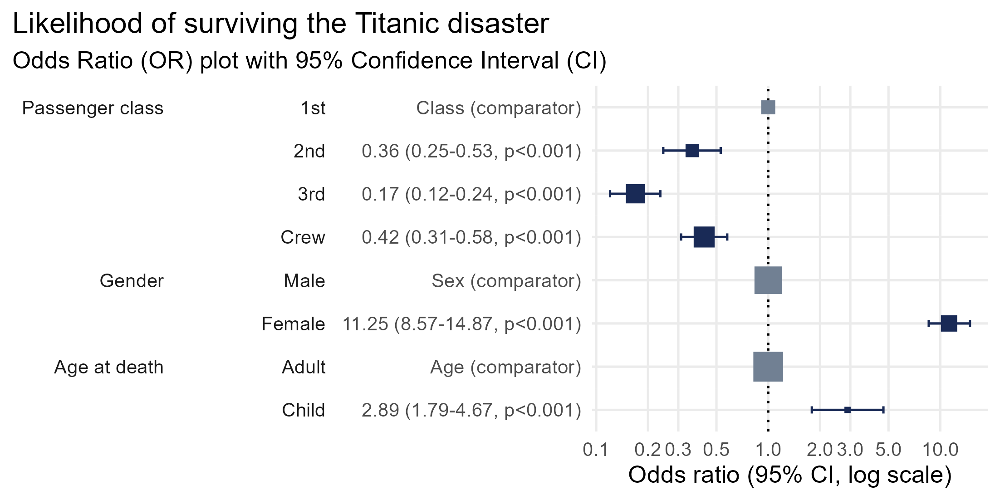

<!-- README.md is generated from README.Rmd. Please edit that file -->

```{r, include = FALSE, label = setup}
knitr::opts_chunk$set(
  collapse = TRUE,
  comment = "#>",
  fig.path = "man/figures/README-",
  out.width = "100%"
)
```

# plotor <a href="https://craig-parylo.github.io/plotor/"></a>

<!-- badges: start -->

[](https://CRAN.R-project.org/package=plotor)
[](https://cran.r-project.org/package=plotor)
[](https://opensource.org/licenses/MIT)

<!-- badges: end -->

**plotor** makes it easy to generate clear, publication-ready **odds-ratio plots** and **tables** from logistic regression models.

If you work with binary outcomes, plotor helps you go from model → interpretation in seconds.

## What plotor does
- Produces clean, ggplot2-based **odds ratio plots**
- Generates **tidy odds ratio tables** (with optional mini-plots)
- Provides **automated assumption checks** for logistic regression
- Works seamlessly with the tidyverse

## Example outputs

### Odds ratio plot
A single function call gives you a polished OR plot:

<!-- <br> -->

<div style="
  box-shadow: 0 4px 12px rgba(0,0,0,0.15); 
  display: inline-block; 
  padding: 12px;
  max-width: 100%;
">
  
</div>
<br>

[See full plot options →](https://craig-parylo.github.io/plotor/reference/plot_or.html)

### Odds ratio table with mini-plot
Perfect for reports and publications:

<div style="
  box-shadow: 0 4px 12px rgba(0,0,0,0.15); 
  display: inline-block; 
  padding: 12px;
  max-width: 100%;
">
  
</div>
<br>

[See full table output options →](https://craig-parylo.github.io/plotor/reference/table_or.html)

### Automated assumption checks
**plotor** includes built-in checks to help validate your logistic regression model:

<div style="
  box-shadow: 0 4px 12px rgba(0,0,0,0.15); 
  display: inline-block; 
  padding: 12px;
  max-width: 100%;
">
  
</div>
<br>

[See full assumption check output →](https://craig-parylo.github.io/plotor/reference/check_or.html)


## Installation

Stable release (CRAN):
```r
install.packages("plotor")
```

Using {pak}:
```r
# install.packages("pak")
pak::pak("plotor")
```

Development version:
```r
# install.packages("pak")
pak::pak("craig-parylo/plotor")
```

## Minimal example
```{r}
#| eval: FALSE
#| label: minimal_example
library(plotor)

# load the titanic dataset from the package
df_titanic <- get_df_titanic()

# make a logistic regression model using this data
model <- stats::glm(
  data = df_titanic,
  formula = Survived ~ Class + Sex + Age,
  family = "binomial"
)

# plot the odds ratios
plot_or(model)
```

## Learn more
- Plotting odds ratios: `?plot_or`
- Tabulating odds ratios: `?table_or`
- Assumption checks: `?check_or`

Full documentation: [https://craig-parylo.github.io/plotor/](https://craig-parylo.github.io/plotor/)
