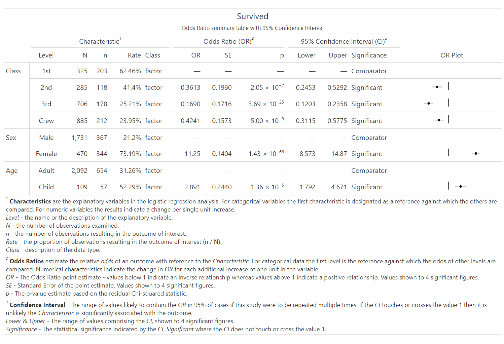

<!-- README.md is generated from README.Rmd. Please edit that file -->

```{r, include = FALSE}
knitr::opts_chunk$set(
  collapse = TRUE,
  comment = "#>",
  fig.path = "man/figures/README-",
  out.width = "100%"
)
```

# plotor <a href="https://craig-parylo.github.io/plotor/"></a>

<!-- badges: start -->

[](https://CRAN.R-project.org/package=plotor)
[](https://cran.r-project.org/package=plotor)

<!-- badges: end -->

The goal of plotor is to generate Odds Ratio plots from logistic
regression models.

## Installation

You can install the development version of plotor from
[GitHub](https://github.com/) with:

``` r
# install.packages("devtools")
devtools::install_github("craig-parylo/plotor")
```

You can also install the latest released version from
[CRAN](https://cloud.r-project.org/web/packages/plotor/index.html) with:

``` r
install.packages("plotor")
```

## Example

In this example we will explore the likelihood of surviving the Titanic
disaster based on passenger economic status (class), sex, and age group.

In addition to `plotor` the packages we will use include `dplyr`,
`tidyr` and `forcats` for general data wrangling, the `stats` package to
conduct the logistic regression followed by `broom` to tidy the output
and convert the results to Odds Ratios and confidence intervals, then
`ggplot2` to visualise the plot.

```{r example, message=FALSE}
library(plotor)      # generates Odds Ratio plots
library(datasets)    # source of example data
library(dplyr)       # data wrangling
library(tidyr)       # data wrangling - uncounting aggregated data
library(forcats)     # data wrangling - handling factor variables
library(stats)       # perform logistic regression using glm function
library(broom)       # tidying glm model and producing OR and CI
library(ggplot2)     # data visualisation
```

Start with getting the data from the datasets package.

```{r}
df <- datasets::Titanic |> 
  as_tibble() |> 
  # convert counts to observations
  filter(n > 0) |>
  uncount(weights = n) |>
  # convert categorical variables to factors.
  # we specify an order for levels in Class and Survival, otherwise ordering
  # in descending order of frequency
  mutate(
    Class = Class |>
      fct(levels = c('1st', '2nd', '3rd', 'Crew')),
    Sex = Sex |>
      fct_infreq(),
    Age = Age |>
      fct_infreq(),
    Survived = Survived |>
      fct(levels = c('No', 'Yes'))
  )
```

We now have a tibble of data containing four columns:

-   `Survived` - our outcome variable describing whether the passenger
    survived `Yes` or died `No`,

-   `Class` - the passenger class, either `1st`, `2nd`, `3rd` or `Crew`,

-   `Sex` - the gender of the passenger, either `Male` or `Female`,

-   `Age` - whether the passenger was an `Adult` or `Child`.

We next conduct a logistic regression of survival (as a binary factor:
'yes' and 'no') against the characteristics of passenger class, sex and
age group. For this we use the Generalised Linear Model function (`glm`)
from the `stats` package, specifying:

-   the family as 'binomial', and

-   the formula as survival being a function of `Class`, `Sex` and
    `Age`.

```{r}
# conduct a logistic regression of survival against the other variables
lr <- glm(
  data = df, 
  family = 'binomial', 
  formula = Survived ~ Class + Sex + Age
  )
```

Finally, we can plot the Odds Ratio of survival using the `plot_or`
function.

```{r warning=FALSE, fig.width=9, fig.height=6, fig.format='png', fig.retina=2}
# using plot_or 
plot_or(glm_model_results = lr)
```

This plot makes it clear that:

-   Children were 2.89 times more likely to survive than Adults,

-   Passengers in `2nd`, `3rd` class as well as `Crew` were all less
    likely to survive than those in `1st` class,

-   Women were 11.25 times more likely to survive than men.

## Table outputs

While an odds ratio plot can effectively visualise the direction and
magnitude of relationships, a table of results offers additional
information such as the value of the odds ratio, p-values and confidence
intervals.

Use the `table_or()` function to return a tibble of details about our
Titanic analysis:

```{r}
# using table_or
table_or(glm_model_results = lr)
```

You can also output these details into a formatted table complete with a
mini OR plot, which is ideal for inclusion in reports and publications.
To do this, add `output = "gt"` as part of the `table_or()` function
call.

```{r eval=FALSE, include=FALSE}
# using table_or with a formatted output
table_or(glm_model_results = lr, output = "gt")
```



## Assumption checks

New to `plotor` is a new suite of automated checks. These checks verify
the data used in your logistic regression analysis upholds the required
assumptions, providing an added layer of confidence in your results.

+---------------+--------------------------------------+---------------+
| Assumption    | Description                          | Status        |
+===============+======================================+===============+
| The outcome   | `plotor` is designed to work with an | ✅            |
| variable is   | outcome variable that has only two   |               |
| **binary**    | possible values, i.e. outcome is     | Introduced in |
|               | **binary**.                          | PR            |
|               |                                      | [42](https:// |
|               |                                      | github.com/cr |
|               |                                      | aig-parylo/pl |
|               |                                      | otor/pull/42) |
+---------------+--------------------------------------+---------------+
| The predictor | Predictor variables which have high  | ✅            |
| variables     | levels of correlation with each      |               |
| should **not  | other is known as                    | Introduced in |
| be highly     | **multicollinearity**.               | PR            |
| correlated**  |                                      | [43](https:// |
| with each     | Where this is the case the odds      | github.com/cr |
| other         | ratio estimates are likely to be     | aig-parylo/pl |
|               | unstable, confidence intervals are   | otor/pull/43) |
|               | likely to be much larger, both of    |               |
|               | which make it difficult to interpret |               |
|               | the results.                         |               |
+---------------+--------------------------------------+---------------+
| The outcome   | In logistic regression,              | ✅            |
| is **not      | **separation** occurs when a         |               |
| separated**   | predictor variable (or a combination | Introduced in |
| by predictors | of predictor variables) perfectly    | PR            |
|               | predicts the outcome variable.       | [47](https:// |
|               |                                      | github.com/cr |
|               | Sepration results in infinite or     | aig-parylo/pl |
|               | extremely large odds ratios and      | otor/pull/47) |
|               | possibly issues with non-convergence |               |
|               | of the logistic regression model,    |               |
|               | making it difficult for the model to |               |
|               | estimate the coefficients.           |               |
+---------------+--------------------------------------+---------------+
| The sample    | The sample size should be large      | In            |
| size is large | enough to provide reliable estimates | development   |
| enough        | of the odds ratio. A general rule of |               |
|               | thumb is to have at least 10 events  |               |
|               | (or outcomes of interest) per        |               |
|               | predictor variable.                  |               |
+---------------+--------------------------------------+---------------+
| The           | Each observation should be           | In            |
| observations  | independent of the others. This      | development   |
| are           | means that the outcome for one       |               |
| independent   | observation should not be influenced |               |
|               | by the outcome of another            |               |
|               | observation.                         |               |
+---------------+--------------------------------------+---------------+
| There are no  | The data should not contain outliers | In            |
| extreme       | or influential observations that can | development   |
| outlier       | significantly affect the estimates   |               |
| values        | of the odds ratio.                   |               |
+---------------+--------------------------------------+---------------+
| There is a    | The relationship between the         | In            |
| linear        | predictor variables and the log odds | development   |
| relationship  | of the outcome should be linear.     |               |
| between the   | This can be checked using diagnostic |               |
| predictors    | plots, such as the logit plot.       |               |
| and the logit |                                      |               |
+---------------+--------------------------------------+---------------+

: Assumptions for logistic regression
