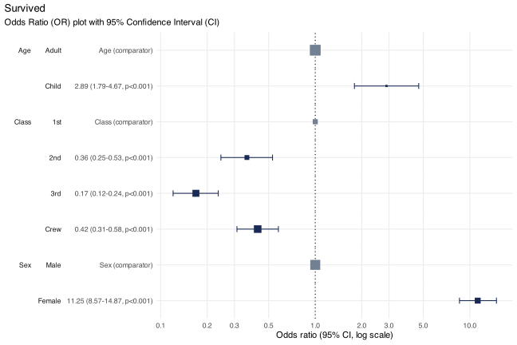

<!-- README.md is generated from README.Rmd. Please edit that file -->

# plotor <a href="https://craig-parylo.github.io/plotor/"></a>

<!-- badges: start -->

[](https://CRAN.R-project.org/package=plotor)
[](https://app.codecov.io/gh/craig-parylo/plotor?branch=main)
<!-- badges: end -->

The goal of plotor is to generate Odds Ratio plots from logistic
regression models.

## Installation

You can install the development version of plotor from
[GitHub](https://github.com/) with:

``` r
# install.packages("devtools")
devtools::install_github("craig-parylo/plotor")
```

You can also install the latest released version from Cran with:

``` r
install.packages("plotor")
```

## Example

In this example we will explore the likelihood of surviving the Titanic
disaster based on passenger economic status (class), sex, and age group.

In addition to `plotor` the packages we will use include `dplyr`,
`tidyr` and `forcats` for general data wrangling, the `stats` package to
conduct the logistic regression followed by `broom` to tidy the output
and convert the results to Odds Ratios and confidence intervals, then
`ggplot2` to visualise the plot.

``` r
library(plotor)      # generates Odds Ratio plots
library(datasets)    # source of example data
library(dplyr)       # data wrangling
library(tidyr)       # data wrangling - uncounting aggregated data
library(forcats)     # data wrangling - handling factor variables
library(stats)       # perform logistic regression using glm function
library(broom)       # tidying glm model and producing OR and CI
library(ggplot2)     # data visualisation
```

Start with getting the data from the datasets package.

``` r
df <- datasets::Titanic |> 
  as_tibble() |> 
  # convert counts to observations
  filter(n > 0) |>
  uncount(weights = n) |>
  # convert categorical variables to factors.
  # we specify an order for levels in Class and Survival, otherwise ordering
  # in descending order of frequency
  mutate(
    Class = Class |>
      fct(levels = c('1st', '2nd', '3rd', 'Crew')),
    Sex = Sex |>
      fct_infreq(),
    Age = Age |>
      fct_infreq(),
    Survived = Survived |>
      fct(levels = c('No', 'Yes'))
  )
```

We now have a tibble of data containing four columns:

- `Survived` - our outcome variable describing whether the passenger
  survived `Yes` or died `No`,

- `Class` - the passenger class, either `1st`, `2nd`, `3rd` or `Crew`,

- `Sex` - the gender of the passenger, either `Male` or `Female`,

- `Age` - whether the passenger was an `Adult` or `Child`.

We next conduct a logistic regression of survival (as a binary factor:
‘yes’ and ‘no’) against the characteristics of passenger class, sex and
age group. For this we use the Generalised Linear Model function (`glm`)
from the `stats` package, specifying:

- the family as ‘binomial’, and

- the formula as survival being a function of `Class`, `Sex` and `Age`.

``` r
# conduct a logistic regression of survival against the other variables
lr <- glm(
  data = df, 
  family = 'binomial', 
  formula = Survived ~ Class + Sex + Age
  )
```

Finally, we can plot the Odds Ratio of survival using the `plot_or`
function.

``` r
# using plot_or 
plot_or(glm_model_results = lr)
```



This plot makes it clear that:

- Children were 2.89 times more likely to survive than Adults,

- Passengers in `2nd`, `3rd` class as well as `Crew` were all less
  likely to survive than those in `1st` class,

- Women were 11.25 times more likely to survive than men.
