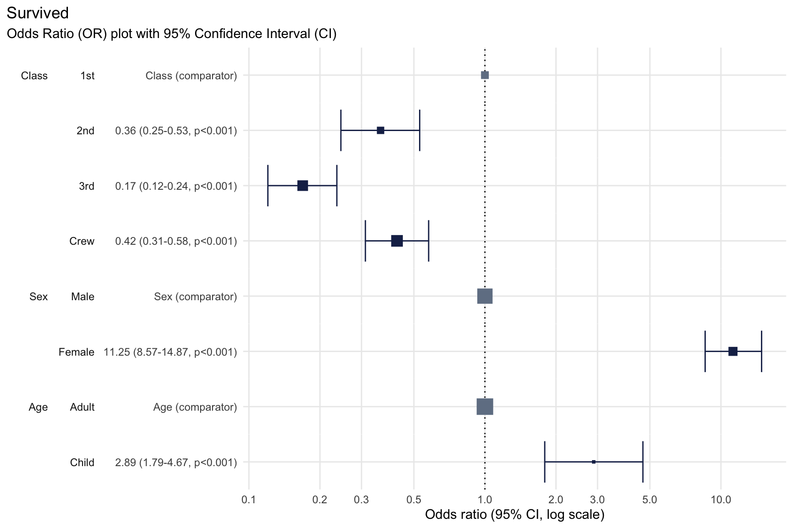
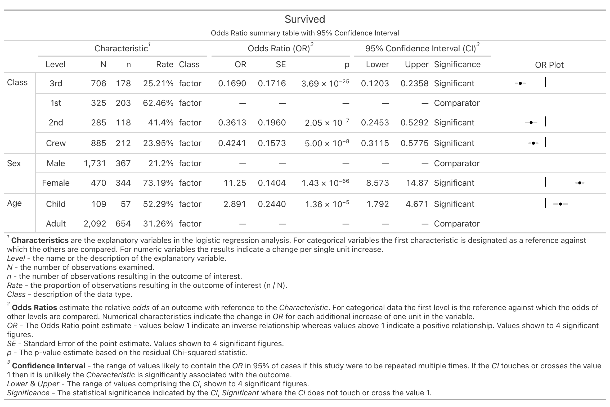

README
================

<!-- README.md is generated from README.Rmd. Please edit that file -->

# plotor <a href="https://craig-parylo.github.io/plotor/"></a>

<!-- badges: start -->

[](https://CRAN.R-project.org/package=plotor)
[](https://cran.r-project.org/package=plotor)

<!-- badges: end -->

The goal of plotor is to generate Odds Ratio plots from logistic
regression models.

## Installation

You can install the development version of plotor from
[GitHub](https://github.com/) with:

``` r
# install.packages("devtools")
devtools::install_github("craig-parylo/plotor")
```

You can also install the latest released version from
[CRAN](https://CRAN.R-project.org/package=plotor) with:

``` r
install.packages("plotor")
```

## Example

In this example we will explore the likelihood of surviving the Titanic
disaster based on passenger economic status (class), sex, and age group.

In addition to `plotor` the packages we will use include `dplyr`,
`tidyr` and `forcats` for general data wrangling, the `stats` package to
conduct the logistic regression followed by `broom` to tidy the output
and convert the results to Odds Ratios and confidence intervals, then
`ggplot2` to visualise the plot.

``` r
library(plotor)      # generates Odds Ratio plots
library(datasets)    # source of example data
library(dplyr)       # data wrangling
library(tidyr)       # data wrangling - uncounting aggregated data
library(forcats)     # data wrangling - handling factor variables
library(stats)       # perform logistic regression using glm function
library(broom)       # tidying glm model and producing OR and CI
library(ggplot2)     # data visualisation
```

Start with getting the data from the datasets package.

``` r
df <- datasets::Titanic |> 
  as_tibble() |> 
  # convert counts to observations
  filter(n > 0) |>
  uncount(weights = n) |>
  # convert categorical variables to factors.
  # we specify an order for levels in Class and Survival, otherwise ordering
  # in descending order of frequency
  mutate(
    Class = Class |>
      fct(levels = c('1st', '2nd', '3rd', 'Crew')),
    Sex = Sex |>
      fct_infreq(),
    Age = Age |>
      fct_infreq(),
    Survived = Survived |>
      fct(levels = c('No', 'Yes'))
  )
```

We now have a tibble of data containing four columns:

- `Survived` - our outcome variable describing whether the passenger
  survived `Yes` or died `No`,

- `Class` - the passenger class, either `1st`, `2nd`, `3rd` or `Crew`,

- `Sex` - the gender of the passenger, either `Male` or `Female`,

- `Age` - whether the passenger was an `Adult` or `Child`.

We next conduct a logistic regression of survival (as a binary factor:
‘yes’ and ‘no’) against the characteristics of passenger class, sex and
age group. For this we use the Generalised Linear Model function (`glm`)
from the `stats` package, specifying:

- the family as ‘binomial’, and

- the formula as survival being a function of `Class`, `Sex` and `Age`.

``` r
# conduct a logistic regression of survival against the other variables
lr <- glm(
  data = df, 
  family = 'binomial', 
  formula = Survived ~ Class + Sex + Age
  )
```

Finally, we can plot the Odds Ratio of survival using the `plot_or`
function.

``` r
# using plot_or 
plot_or(glm_model_results = lr)
```



This plot makes it clear that:

- Children were 2.89 times more likely to survive than Adults,

- Passengers in `2nd`, `3rd` class as well as `Crew` were all less
  likely to survive than those in `1st` class,

- Women were 11.25 times more likely to survive than men.

## Table outputs

While an odds ratio plot can effectively visualise the direction and
magnitude of relationships, a table of results offers additional
information such as the value of the odds ratio, p-values and confidence
intervals.

Use the `table_or()` function to return a tibble of details about our
Titanic analysis:

``` r
# using table_or
table_or(glm_model_results = lr)
#> # A tibble: 8 × 14
#>   label level   rows outcome outcome_rate class  estimate std.error statistic
#>   <fct> <fct>  <int>   <int>        <dbl> <chr>     <dbl>     <dbl>     <dbl>
#> 1 Class 1st      325     203        0.625 factor   NA        NA         NA   
#> 2 Class 2nd      285     118        0.414 factor    0.361     0.196     -5.19
#> 3 Class 3rd      706     178        0.252 factor    0.169     0.172    -10.4 
#> 4 Class Crew     885     212        0.240 factor    0.424     0.157     -5.45
#> 5 Sex   Male    1731     367        0.212 factor   NA        NA         NA   
#> 6 Sex   Female   470     344        0.732 factor   11.2       0.140     17.2 
#> 7 Age   Adult   2092     654        0.313 factor   NA        NA         NA   
#> 8 Age   Child    109      57        0.523 factor    2.89      0.244      4.35
#> # ℹ 5 more variables: p.value <dbl>, conf.low <dbl>, conf.high <dbl>,
#> #   significance <chr>, comparator <dbl>
```

You can also output these details into a formatted table complete with a
mini OR plot, which is ideal for inclusion in reports and publications.
To do this, add `output = "gt"` as part of the `table_or()` function
call.



## Assumption checks

New to `plotor` is a new suite of automated checks. These checks verify
the data used in your logistic regression analysis upholds the required
assumptions, providing an added layer of confidence in your results.

<table style="width:96%;">
<caption>Assumptions for logistic regression</caption>
<colgroup>
<col style="width: 22%" />
<col style="width: 51%" />
<col style="width: 22%" />
</colgroup>
<thead>
<tr>
<th>Assumption</th>
<th>Description</th>
<th>Status</th>
</tr>
</thead>
<tbody>
<tr>
<td>The outcome variable is <strong>binary</strong></td>
<td><code>plotor</code> is designed to work with an outcome variable
that has only two possible values, i.e. outcome is
<strong>binary</strong>.</td>
<td><p>✅</p>
<p>Introduced in PR <a href="#42">42</a></p></td>
</tr>
<tr>
<td>The predictor variables should <strong>not be highly
correlated</strong> with each other</td>
<td><p>Predictor variables which have high levels of correlation with
each other is known as <strong>multicollinearity</strong>.</p>
<p>Where this is the case the odds ratio estimates are likely to be
unstable, confidence intervals are likely to be much larger, both of
which make it difficult to interpret the results.</p></td>
<td><p>✅</p>
<p>Introduced in PR <a href="#43">43</a></p></td>
</tr>
<tr>
<td>The outcome is <strong>not separated</strong> by predictors</td>
<td><p>In logistic regression, <strong>separation</strong> occurs when a
predictor variable (or a combination of predictor variables) perfectly
predicts the outcome variable.</p>
<p>Separation results in infinite or extremely large odds ratios and
possibly issues with non-convergence of the logistic regression model,
making it difficult for the model to estimate the coefficients.</p></td>
<td><p>✅</p>
<p>Introduced in PR <a href="#47">47</a></p></td>
</tr>
<tr>
<td>The sample size is large enough</td>
<td>The sample size should be large enough to provide reliable estimates
of the odds ratio. A general rule of thumb is to have at least 10 events
(or outcomes of interest) per predictor variable.</td>
<td>In development</td>
</tr>
<tr>
<td>The observations are independent</td>
<td>Each observation should be independent of the others. This means
that the outcome for one observation should not be influenced by the
outcome of another observation.</td>
<td>In development</td>
</tr>
<tr>
<td>There are no extreme outlier values</td>
<td>The data should not contain outliers or influential observations
that can significantly affect the estimates of the odds ratio.</td>
<td>In development</td>
</tr>
<tr>
<td>There is a linear relationship between the predictors and the
logit</td>
<td>The relationship between the predictor variables and the log odds of
the outcome should be linear. This can be checked using diagnostic
plots, such as the logit plot.</td>
<td>In development</td>
</tr>
</tbody>
</table>
