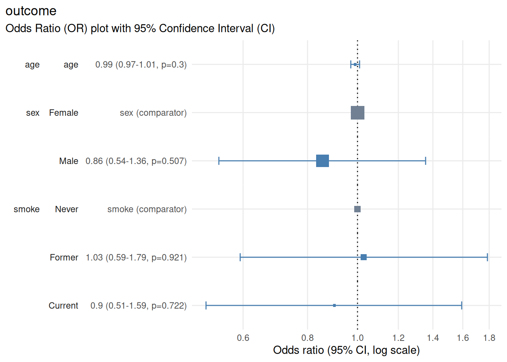

# plot_or: Forest plots for logistic regression

``` r
library(plotor)
set.seed(123) # reproducibility
```

## Overview

[`plot_or()`](https://craig-parylo.github.io/plotor/reference/plot_or.md)
creates publication-ready forest plots from logistic regression models
fitted with `stats::glm(family = "binomial")`. It visualises odds ratios
with confidence intervals, making it easy to communicate effect sizes,
precision and statistical significance at a glance.

## When to use this function

Use
[`plot_or()`](https://craig-parylo.github.io/plotor/reference/plot_or.md)
when you need to:

- **Visualise effect sizes** from logistic regression models

- **Compare odds ratios across predictors** in a single plot

- **Communicate precision** of estimates (via confidence interval width)

- **Highlight statistical significance** visually

- **Create publication-ready figures** for manuscripts or reports

- **Compare results across multiple models** (side-by-side or stacked)

**Note**:
[`plot_or()`](https://craig-parylo.github.io/plotor/reference/plot_or.md)
works only with `glm(family = "binomial")`. It does not support logistic
regression via other packages (e.g., `glm2`, `logistf`) or ordinal /
multinomial logistic regression.

## Quick example - minimal workflow

``` r
# create a small example dataset
rows <- 400
df <- data.frame(
  outcome = rbinom(n = rows, size = 1, prob = 0.25) |> 
    factor(labels = c("Healthy", "Disease")),
  age = rnorm(n = rows, mean = 50, sd = 12),
  sex = sample(x = 0:1, size = rows, replace = TRUE) |> 
    factor(labels = c("Female", "Male")),
  smoke = sample(x = 0:2, size = rows, replace = TRUE) |> 
    factor(labels = c("Never", "Former", "Current"))
)

# fit a logistic regression model
m <- glm(
  formula = outcome ~ age + sex + smoke,
  family = "binomial",
  data = df
)

# create the forest plot
plot_or(m)
```



### Output

The resulting plot displays:

- **Horizontal axis**: odds ratio on a log scale

- **Vertical axis**: model predictors and factor levels along with
  details of point estimates, confidence interval and p-value

- **Points**: odds ratio point estimates shown as boxes, which scale in
  proportion to the number of rows starting the regression

- **Horizontal lines**: 95% confidence intervals (can be configured by
  setting parameter `conf_level`)

- **Vertical reference line**: OR = 1.0 (null effect)

- **Colour coding**: Ssignificant (CI does not cross 1.0) vs
  non-significant (CI crosses 1.0) vs reference level (factor
  predictors)

### Interpreting effect sizes

- **0.5 - 0.9**: Decreased odds (protective effect); moderate to small

- **0.9 - 1.0**: Decreased odds (protective effect); very small

- **1.0**: No effect (null)

- **1.0 - 1.1**: Increased odds; very small

- **1.1 - 2.0**: Increased odds (risk factor); small to moderate

- **2.0+**: Increased odds (risk factor); large

### Interpreting confidence intervals

``` r
# ensure reproducibility
set.seed(123)

# create a small example dataset
rows <- 400
df <- data.frame(
  narrow_interval = rnorm(n = rows, sd = 10),
  wide_interval = rnorm(n = rows, sd = 1),
  interval_crosses_1 = rnorm(n = rows, sd = 3),
  interval_doesnt_cross_1 = rnorm(n = rows, sd = 3)
)

# create outcome based on predictors to achieve desired associations:
# narrow_interval: strong association (narrow CI)
# wide_interval: weak association (wide CI)
# interval_crosses_1: very weak association (CI crosses 1)
# interval_doesnt_cross_1: moderate association (CI doesn't cross 1)
df$outcome <- 
  rbinom(
    n = rows,
    size = 1,
    prob = plogis(
      0 + # intercept
      2 * scale(df$narrow_interval)[, 1] + 
      0.1 * scale(df$wide_interval)[, 1] + 
      0.01 * scale(df$interval_crosses_1)[, 1] + 
      -0.3 * scale(df$interval_doesnt_cross_1)[, 1]
    )
  ) |> factor(labels = c("Healthy", "Disease"))

# fit a logistic regression model
m <- glm(
  formula = outcome ~ narrow_interval + wide_interval + 
    interval_crosses_1 + interval_doesnt_cross_1,
  family = "binomial",
  data = df
)

# create the forest plot (skip checks on logistic regression assumptions)
plotor::plot_or(m, assumption_checks = FALSE)
```


- **Narrow interval**: precise estimate (large sample or strong signal)

- **Wide interval**: imprecise estimate (small sample or weak signal)

- **Interval crosses 1.0**: not statistically significant

- **Interval does not cross 1.0**: statistically significant

## Exporting plots

Use the
**[`ggplot2::ggsave()`](https://ggplot2.tidyverse.org/reference/ggsave.html)**
function to export your forest plot to a file for further use.

### Save as PNG (raster)

``` r
p <- plot_or(m)
ggplot2::ggsave(
  filename = "forest_plot.png",
  plot = p,
  width = 10,
  height = 6,
  dpi = 300
)
```

Use PNG for:

- Online documents, websites, presentations

- When file size matters

- Quick sharing

### Save as PDF (vector)

``` r
p <- plot_or(m)
ggplot2::ggsave(
  filename = "forest_plot.pdf",
  plot = p,
  width = 10,
  height = 6
)
```

Use PDF for:

- Manuscripts and publications (scalable without quality loss)

- Professional reports

- When you need to edit the figure later

### Tips for publication-ready plots

#### Choose appropriate dimensions

- **Typical forest plot**: 10 cm wide x 6-8 cm tall (4 x 2.4-3.2 inches)

- **Many predictors**: 10 cm x 12-15 cm (4 x 4.7-5.9 inches)

- **Single predictor**: 8 cm x 4 cm (3.1 x 1.6 inches)

Adjust `width` and `height` in
[`ggsave()`](https://ggplot2.tidyverse.org/reference/ggsave.html)
accordingly.

### Label predictors clearly

Ensure predictor and factor level names are:

- Descriptive (e.g., “Age (per 10-year increase)” instead of “age”)

- Consistent with your table labels (see
  [`vignette("table_or")`](https://craig-parylo.github.io/plotor/articles/table_or.md))

- Free of abbreviations or jargon unfamililar to your audience

## Notes and limitations

- **Categorical reference levels**: the first level of each factor is
  used as the reference (OR = 1.0). To change the reference, reorder
  factor levels before fitting the model.

- **Numeric variable scaling**: for numeric predictors, the OR
  represents change per one-unit increase. Consider scaling (e.g., age
  in decades) for more interpretable ORs.

- **Many predictors**: if your model has many predictors, the plot may
  become crowded. Consider:

  - Creating separate plots for subsets of predictors

  - Increasing figure height

- **Confidence interval interpretation**: a confidence interval
  represents the range of values that would be consistent with your
  observed data if you repeated the study many times under identical
  conditions. It does not represent the probability that the true OR
  falls within this range.

## Conclusion

[`plot_or()`](https://craig-parylo.github.io/plotor/reference/plot_or.md)
transforms logistic regression results into intuitive, publication-ready
forecast plots. By visualising odds ratios, confidence intervals and
statistical significance together, it helps readers quickly grasp effect
sizes and precision - making it an essential tool for communicating
statistical findings effectively.

## See also

- [`vignette("table_or")`](https://craig-parylo.github.io/plotor/articles/table_or.md) -
  formatting results tables and exporting with {gt}

- [`vignette("check_or")`](https://craig-parylo.github.io/plotor/articles/check_or.md) -
  diagnostics and model validation

- [`ggplot2::ggplot()`](https://ggplot2.tidyverse.org/reference/ggplot.html) -
  ggplot2 documentation for further cusomisation

- [`ggplot2::ggsave()`](https://ggplot2.tidyverse.org/reference/ggsave.html) -
  saving and exporting plots
