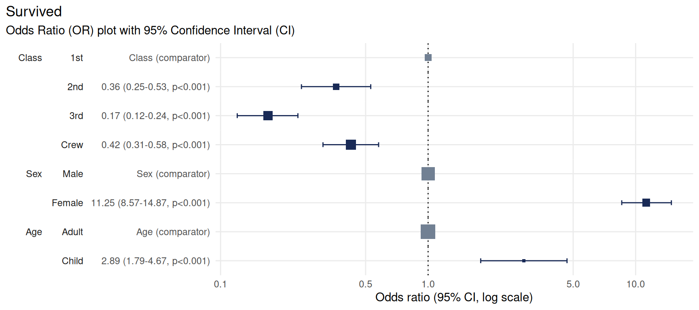
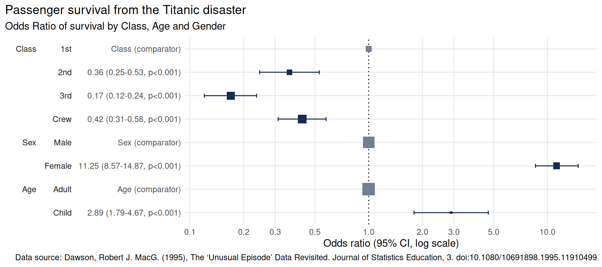

# Using plotor

``` r
library(plotor)
library(dplyr)
library(datasets)
library(tidyr)
library(stats)
library(broom)
library(forcats)
library(ggplot2)
```

`plotor` produces Odds-Ratio plots from a given logistic regression
model, as produced using the general linear model (`glm`) package.

## Installing plotor

`plotor` can be installed via GitHub using the `devtools` package:

``` r
# install.packages("devtools")
devtools::install_github("craig-parylo/plotor")
```

You can also install the latest released version from Cran with:

``` r
install.packages("plotor")
```

## Example 1 - using the Titanic survivors data set

Let’s start by exploring the likelihood of surviving the Titanic
disaster based on passenger economic status (class), sex, and age group.

Get and prepare
[data](https://stat.ethz.ch/R-manual/R-devel/library/datasets/html/Titanic.html)
from the `datasets` package.

``` r
df <- datasets::Titanic |> 
  as_tibble() |> 
  # convert counts to observations
  filter(n > 0) |>
  uncount(weights = n) |>
  # convert categorical variables to factors.
  # we specify an order for levels in Class and Survival, otherwise ordering
  # in descending order of frequency
  mutate(
    Class = Class |>
      fct(levels = c('1st', '2nd', '3rd', 'Crew')),
    Sex = Sex |>
      fct_infreq(),
    Age = Age |>
      fct_infreq(),
    Survived = Survived |>
      fct(levels = c('No', 'Yes'))
  )

# preview the data
df |> glimpse()
#> Rows: 2,201
#> Columns: 4
#> $ Class    <fct> 3rd, 3rd, 3rd, 3rd, 3rd, 3rd, 3rd, 3rd, 3rd, 3rd, 3rd, 3rd, 3…
#> $ Sex      <fct> Male, Male, Male, Male, Male, Male, Male, Male, Male, Male, M…
#> $ Age      <fct> Child, Child, Child, Child, Child, Child, Child, Child, Child…
#> $ Survived <fct> No, No, No, No, No, No, No, No, No, No, No, No, No, No, No, N…
```

We now have a tibble of data containing four columns:

- `Survived` - our outcome variable describing whether the passenger
  survived `Yes` or died `No`,

- `Class` - the passenger class, either `1st`, `2nd`, `3rd` or `Crew`,

- `Sex` - the gender of the passenger, either `Male` or `Female`,

- `Age` - whether the passenger was an `Adult` or `Child`.

We next conduct a logistic regression of survival (as a binary factor:
‘yes’ and ‘no’) against the characteristics of passenger class, sex and
age group. For this we use the Generalised Linear Model function (`glm`)
from the `stats` package, specifying:

- the family as ‘binomial’, and

- the formula as survival being a function of `Class`, `Sex` and `Age`.

``` r
# conduct a logistic regression of survival against the other variables
lr <- glm(
  data = df,
  family = 'binomial',
  formula = Survived ~ Class + Sex + Age
)

# preview the model as a tidy table
lr |> 
  tidy() |> 
  glimpse()
#> Rows: 6
#> Columns: 5
#> $ term      <chr> "(Intercept)", "Class2nd", "Class3rd", "ClassCrew", "SexFema…
#> $ estimate  <dbl> -0.3762229, -1.0180950, -1.7777622, -0.8576762, 2.4200603, 1…
#> $ std.error <dbl> 0.1361769, 0.1959969, 0.1715657, 0.1573387, 0.1404093, 0.244…
#> $ statistic <dbl> -2.762751, -5.194443, -10.361993, -5.451147, 17.235750, 4.35…
#> $ p.value   <dbl> 5.731642e-03, 2.053331e-07, 3.691891e-25, 5.004592e-08, 1.43…
```

Finally, we can plot the Odds Ratio of survival using the `plot_or`
function.

``` r
# using plot_or
plot_or(glm_model_results = lr)
```


This plot makes it clear that:

- Children were 2.89 times more likely to survive than Adults,

- Passengers in `2nd`, `3rd` class as well as `Crew` were all less
  likely to survive than those in `1st` class,

- Women were 11.25 times more likely to survive than men.

#### Note on plot features

The primary components of an Odds-Ratio plot are dots, whiskers and the
line of no effect.

The dot represents the point estimate for the Odds-Ratio, which
indicates how much more likely the event is than the comparator event.

The width of the whiskers represents the Confidence Interval, a range of
values the point estimate (the dot) is likely to fall within if the
study were to be repeated, most often with a probability of 95%.

The line of no effect is set at a value of 1. Events whose confidence
intervals touch or cross this line are considered to show no difference
in likelihood than the comparator event.

The size of the dots is proportional to the number of observations. In
the above, the size of the `Adult` square is much larger than the
`Child` square, because there were 20 times more adults on the ship than
children. This feature can help contextualise the findings from OR
plots.

### Change base font size

To increase the size of the font you can extend the returned plot using
the [theme](https://ggplot2.tidyverse.org/reference/theme.html) function
from `ggplot2`. Here we set the base size of all fonts in the plot to
size 16.

``` r
plot_or(glm_model_results = lr) + 
  theme(text = element_text(size = 16))
```


### Specify the breaks

Odds Ratio (OR) plots produced by `plotor` are displayed using a log10
x-axis.

By default ten breaks are shown, however, this can be altered by
extending the
[`scale_x_log10`](https://ggplot2.tidyverse.org/reference/scale_continuous.html)
function from `ggplot2`. Here we provide a manual list of breaks to use:

``` r
plot_or(glm_model_results = lr) + 
  scale_x_log10(breaks = c(0.1, 0.5, 1, 5, 10))
```



### Change the confidence level

Confidence Intervals are calculated using a percentage confidence,
called the *Confidence Level*, which sometimes range from 80% to 99% but
95% is most commonly-used.

The default in {plotor} is 95% but from version 0.5.3 onward you can
change this by specifying a `conf_level` parameter in your
[`plot_or()`](https://craig-parylo.github.io/plotor/reference/plot_or.md)
call. Here we set the Confidence Level to 99% for the Titanic data set:

``` r
plot_or(glm_model_results = lr, conf_level = 0.99)
```


Notice how the whiskers have grown slightly? This is because we wished
to be *more* confident (an additional 4% on top of the 95% we used
previously) that the Confidence Interval covers all values the Odds
Ratio estimate could take if we were to repeat this experiment multiple
times. Thus the Confidence Interval was increased to match our expected
*Confidence Level*.

In this example the increased length of the resulting Confidence
intervals still do not cross the dotted line and so do not affect our
conclusions that `1st` class passengers were more likely to survive than
all other classes of people, `Women` were more likely to survive than
`Men` and `Children` were more likely to survive than `Adults`.

### Change the dot and whisker colours

There are three types of colours used for the dots and whiskers in the
OR plot, depending on their category.

- `Significant` refers to dots where their results indicate a
  significant finding because their 95% confidence intervals do not
  touch or cross the value 1 - the line of no effect.

- `Comparator` refers to the level of a factor in the model against
  which the Odds Ratios are calculated.

- `Not significant` refers to dots where their results do not indicate a
  significant finding because their confidence intervals touch or cross
  the line of no effect.

The colours for these points can be changed by extending the output
using
[`scale_colour_manual`](https://ggplot2.tidyverse.org/reference/scale_manual.html)
function from `ggplot2` with a named vector specifying colour values for
the three types of colours:

``` r
plot_or(glm_model_results = lr) +
  scale_colour_manual(values = c(
    'Significant' = '#44bd32',
    'Comparator' = '#8c7ae6',
    'Not significant' = '#e84118')
  )
```


### Change the title, subtitle and add a caption

`plotor` uses the dependent variable as the title of the plot by default
with a subtitle indicating this it is an Odds Ratio plot with a 95%
confidence interval.

The plot can be customised with your own title, subtitle and add a
caption by extending the
[`labs`](https://ggplot2.tidyverse.org/reference/labs.html) function of
`ggplot2`.

``` r
plot_or(glm_model_results = lr) +
  labs(
    title = 'Passenger survival from the Titanic disaster',
    subtitle = 'Odds Ratio of survival by Class, Age and Gender',
    caption = 'Data source: Dawson, Robert J. MacG. (1995), The ‘Unusual Episode’ Data Revisited. Journal of Statistics Education, 3. doi:10.1080/10691898.1995.11910499'
  )
```



## Example 2 - using the Smoking, Alcohol and Oesophageal Cancer data set

This
[data](https://stat.ethz.ch/R-manual/R-devel/library/datasets/html/esoph.html)
set comes from a case-control study of oesophageal cancer in
Ile-et-Vilaine, France. In addition to the outcome variable, `Group`,
identifying who is a case (developed cancer) or a control (disease
free), it contains three explanatory variables:

- `agegp` - the age group of each participant,

- `alcgp` - the alcohol consumption of each participant, measured in
  grams per day,

- `tobgp` - the tobacco consumption of each participant, measured in
  grams per day.

To look at the likelihood of a participant to develop oesophageal cancer
we can perform logistic regression against these variables.

``` r
df <- datasets::esoph |> 
  # convert aggregated data to tidy observational data
  tidyr::pivot_longer(
    cols = c(ncases, ncontrols),
    names_to = 'Group',
    values_to = 'people'
  ) |> 
  uncount(weights = people) |> 
  # prepare the variables
  mutate(
    # convert the intervention group to a factor
    Group = Group |> 
      case_match('ncases' ~ 'Case', 'ncontrols' ~ 'Control') |> 
      fct(levels = c('Control', 'Case')),
    # remove the ordering from these factors so the glm model doesn't treat
    # them as numeric
    agegp = agegp |> factor(ordered = F),
    alcgp = alcgp |> factor(ordered = F),
    tobgp = tobgp |> factor(ordered = F)
  )

# preview the data
df |> glimpse()
#> Rows: 975
#> Columns: 4
#> $ agegp <fct> 25-34, 25-34, 25-34, 25-34, 25-34, 25-34, 25-34, 25-34, 25-34, 2…
#> $ alcgp <fct> 0-39g/day, 0-39g/day, 0-39g/day, 0-39g/day, 0-39g/day, 0-39g/day…
#> $ tobgp <fct> 0-9g/day, 0-9g/day, 0-9g/day, 0-9g/day, 0-9g/day, 0-9g/day, 0-9g…
#> $ Group <fct> Control, Control, Control, Control, Control, Control, Control, C…
```

Next we carry out the logistic regression and then plot the results.

``` r
# conduct the logistic regression
lr <- glm(
  data = df,
  family = 'binomial',
  formula = Group ~ agegp + alcgp + tobgp
)

# plot the odds ratio plot with customised title
plot_or(lr) +
  labs(title = 'Likelihood of developing oesophageal cancer')
```


From this we can see there is a strong link between age and likelihood
of cancer. Compared with those in the `25-34` years group there is a
statistically significant increased likelihood of being in the case
cohort of those in the `45-54` years group (43 times more likely),
`55-64` years group (76 times more likely), `65-74` years group (133
times more likely), and `75+` years group (124 times more likely).

There is also a strong link between alcohol consumption and likelihood
of cancer. Compared with those who consumed the least alcohol, defined
as between 0 and 39 g/day, those who consumed more alcohol are more at
risk of developing cancer with the greatest risk in those who consumed
more than 119 g/day, putting them at 36 times more likely to develop
cancer.

Tobacco use is a more nuanced picture. There was no detectable
difference in the likelihood of developing cancer for those in the first
three groups (`0-9g/day`, `10-19g/day` and `20-29g/day`) - seen by the
confidence intervals crossing the line of no effect. However, there was
a statistically significant increased risk of developing cancer in those
who consumed the most tobacco, `30+g/day`, putting them at 5 times the
risk.

### Use variable labels

Replacing variable names with a more descriptive label makes the plots
more accessible to those not involved in the analysis. For example,
`Alcohol consumption (g/day)` is a more user-friendly label than the
name of the variable, `alcgp`.

There are some amazing packages designed to help label your data. In the
below example we use the
[`labelled`](https://larmarange.github.io/labelled/) package to label
our data before analysing and plotting it.

``` r
# library to apply labels to data
library(labelled)

# create a list of variable = labels
var_labels <- list(
  agegp = 'Age group',
  alcgp = 'Alcohol consumption',
  tobgp = 'Tobacco consumption',
  Group = 'Developing oesophageal cancer'
)

# label the variables in our data
labelled::var_label(df) <- var_labels

# preview the data with labels appplied 
labelled::look_for(df)
#>  pos variable label                         col_type missing values   
#>  1   agegp    Age group                     fct      0       25-34    
#>                                                              35-44    
#>                                                              45-54    
#>                                                              55-64    
#>                                                              65-74    
#>                                                              75+      
#>  2   alcgp    Alcohol consumption           fct      0       0-39g/day
#>                                                              40-79    
#>                                                              80-119   
#>                                                              120+     
#>  3   tobgp    Tobacco consumption           fct      0       0-9g/day 
#>                                                              10-19    
#>                                                              20-29    
#>                                                              30+      
#>  4   Group    Developing oesophageal cancer fct      0       Control  
#>                                                              Case
```

Analyse the data using logistic regression as before and plot the
result.

``` r
# conduct the logistic regression
lr <- glm(
  data = df,
  family = 'binomial',
  formula = Group ~ agegp + alcgp + tobgp
)

# plot the odds ratio plot using variable labels
plot_or(lr)
```


`plot_or` recognises the use of labels and uses these in preference to
variable names wherever available.

Using variable labels makes plots easier to read and more accessible,
and is especially useful where you want to include the chart in reports
or publications.

### Control covariate order

Sometimes it can be useful to control the ordering of covariates in the
plots. This can be done to group similar variables together, such as
demographics, or arrange the covariates in a more pleasing order.

For example, imagine we wish to display our tobacco consumption Odds
Ratios at the top of the plot because this is the main focus of our
study and wish to draw attention to these findings. The age group can be
put at the bottom of the plot.

As of version 0.5.2 onwards
[plotor](https://github.com/craig-parylo/plotor) facilitates this need
by respecting the order in which the covariates are listed in the model.

``` r
# conduct the logistic regression with tobacco listed first in the 'formula'
lr <- glm(
  data = df,
  family = 'binomial',
  formula = Group ~ tobgp + alcgp + agegp
)

# plot the odds ratio plot using variable labels
plot_or(lr)
```


We now have tobacco as the first covariate on the y-axis and age group
as the last covariate.

### Summarise in a table

Odds Ratio plots are often accompanied by summary tables in academic
papers. These tables provide details not always visible from the plot,
such as the number of observations in each category and the conversion
rate from the base population to those with the outcome of interest.

From version 0.5.3 [plotor](https://github.com/craig-parylo/plotor) can
produce these summary tables using the new function
[`table_or()`](https://craig-parylo.github.io/plotor/reference/table_or.md)
as either a `tibble` or a publication-ready [gt](https://gt.rstudio.com)
table.

``` r
table_or(lr, output = 'tibble')
#> ℹ One or more assumptions for logistic regression have failed. To gain further
#> insights, consider calling the `plotor::check_or()` function. For example, you
#> can run `plotor::check_or(lr, details = TRUE)`.
#> # A tibble: 14 × 14
#>    label     level  rows outcome outcome_rate class estimate std.error statistic
#>    <fct>     <fct> <int>   <int>        <dbl> <chr>    <dbl>     <dbl>     <dbl>
#>  1 "Age gro… 25-34   116       1      0.00862 fact…    NA       NA         NA   
#>  2 "Age gro… 35-44   199       9      0.0452  fact…     7.25     1.10       1.79
#>  3 "Age gro… 45-54   213      46      0.216   fact…    43.7      1.07       3.54
#>  4 "Age gro… 55-64   242      76      0.314   fact…    76.3      1.06       4.07
#>  5 "Age gro… 65-74   161      55      0.342   fact…   134.       1.08       4.55
#>  6 "Age gro… 75+      44      13      0.295   fact…   125.       1.12       4.30
#>  7 "Alcohol… 0-39…   415      29      0.0699  fact…    NA       NA         NA   
#>  8 "Alcohol… 40-79   355      75      0.211   fact…     4.20     0.250      5.74
#>  9 "Alcohol… 80-1…   138      51      0.370   fact…     7.25     0.285      6.96
#> 10 "Alcohol… 120+     67      45      0.672   fact…    36.7      0.385      9.36
#> 11 "Tobacco… 0-9g…   525      78      0.149   fact…    NA       NA         NA   
#> 12 "Tobacco… 10-19   236      58      0.246   fact…     1.55     0.228      1.92
#> 13 "Tobacco… 20-29   132      33      0.25    fact…     1.67     0.273      1.88
#> 14 "Tobacco… 30+      82      31      0.378   fact…     5.16     0.344      4.77
#> # ℹ 5 more variables: p.value <dbl>, conf.low <dbl>, conf.high <dbl>,
#> #   significance <chr>, comparator <dbl>
```

The tibble contains details

- `label` containing the name or label for the variables,

- `level` describing the contents of categorical variables,

- `rows` enumerating the number of observations relevant to each
  category level,

- `outcome` enumerating the number of observations which resulted in the
  outcome of interest,

- `outcome_rate` showing the conversion from `rows` to `outcome`,

- `class` describing the data class for the variable,

- `estimate` is the Odds Ratio point estimate,

- `std.error` is the standard error for the Odds Ratio,

- `p.value` is the probability of producing the Odds Ratio estimate by
  chance,

- `conf.low` is the lower confidence interval,

- `conf.high` is the upper confidence interval,

- `significance` is a description of whether the Odds Ratio is
  statistically significant, with reference to the confidence interval,

The tibble format means this information can be re-used in custom tables
and visualisations.

Specify `output = 'gt'` to get a publication-quality html table made
using the [gt](https://gt.rstudio.com) package.

``` r
table_or(lr, output = 'gt') |> 
  gt::tab_options(container.width = 1100)
#> ℹ One or more assumptions for logistic regression have failed. To gain further
#> insights, consider calling the `plotor::check_or()` function. For example, you
#> can run `plotor::check_or(lr, details = TRUE)`.
```

[TABLE]

The main features of this table include:

- number formatting such as thousands separators for counts and rounding
  to the nearest four significant figures to prevent precision clutter,

- footnotes explaining each section and providing a key to the column
  headings,

- title defaulting to the outcome variable and subtitle providing a
  description of what the table contains, these can be changed by
  extending {gt} functions.

- a simple OR plot to give a sense of the distributions of Odds Ratio
  estimates.
